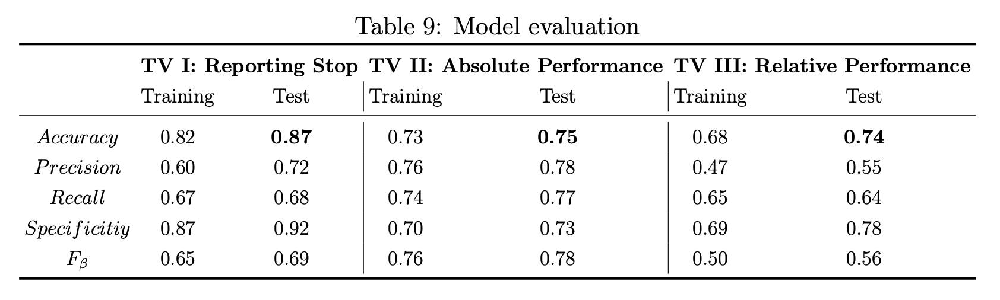
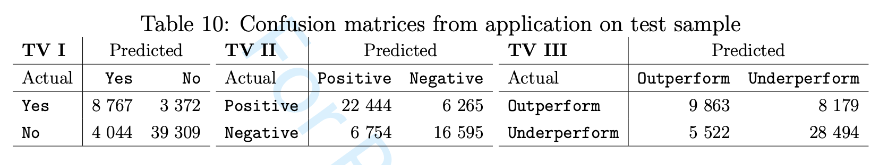
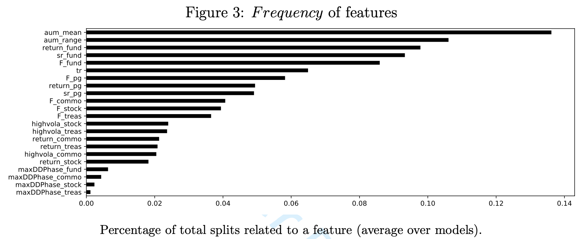
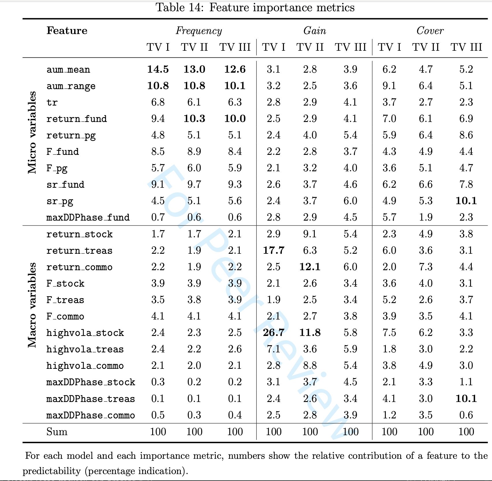

# Hedge Fund Performance & Reporting Stop Predictability

> Published paper: [Performance and Reporting Predictability of Hedge Funds](https://onlinelibrary.wiley.com/doi/10.1002/for.3122?af=R) — Journal of Forecasting, Wiley (2020)

Forecasting hedge fund outcomes using gradient-boosted decision trees on a panel of 5,592 funds and 300,000+ monthly observations.

> **Reporting Stop 87%** · **Absolute Performance 75%** · **Relative Performance 74%**

---

## Motivation

Hedge fund due diligence relies heavily on backward-looking analysis, yet allocators need forward-looking signals. This project builds predictive models that classify whether a fund will (i) stop reporting, (ii) deliver positive risk-adjusted returns, or (iii) outperform its strategy peer group — all within a 12-month horizon. The key finding is that fund-specific micro factors (AUM dynamics, past Sharpe ratios) carry substantially more predictive power than macro-market variables.

## Methodology

**Model:** XGBoost gradient-boosted classifier with `TimeSeriesSplit` cross-validation (10 folds) and class-balanced sample weighting.

**Data:** 5,592 hedge funds sourced from Eurekahedge (Jan 2000 – Dec 2019), filtered to USD-denominated funds with ≥ 24 months track record across 14 strategies.

**Features (22):**

| Micro (fund-specific) | Macro (market environment) |
|---|---|
| Track record length | S&P 500 / Treasury / Commodity returns |
| AUM mean & AUM change | Empirical CDF of market returns |
| Sharpe ratio (fund & peer group) | Max-drawdown phase (equities, bonds, commodities) |
| Geometric mean return (fund & peer group) | Volatility regime ratio (12m / 24m) |
| Empirical CDF of fund returns | |
| Max-drawdown phase (fund) | |

**Targets:**

| Model | Question | Accuracy |
|---|---|---|
| Reporting stop | Will the fund stop reporting within 12 months? | 87% |
| Absolute performance | Will the forward Sharpe ratio be positive? | 75% |
| Relative performance | Will the fund outperform its strategy peer group? | 74% |

## Results

### Model Evaluation



### Confusion Matrices (Test Set)



### Feature Importance — Split Frequency



### Feature Importance — Detailed Metrics



## Repository Structure
├── data/
│   ├── raw/                    Raw input CSVs
│   └── processed/              Intermediate feature sets
├── results/
│   └── figures/                Confusion matrices, importance plots
├── src/
│   ├── config.py               Constants, paths, hyperparameters
│   ├── data_loader.py          Ingestion, filtering, peer-group benchmarks
│   ├── feature_engineering.py  Drawdowns, Sharpe ratios, ECDFs, targets
│   ├── modelling.py            XGBoost + GridSearchCV + TimeSeriesSplit
│   ├── evaluation.py           Metrics, confusion matrices, importance analysis
│   └── main.py                 CLI pipeline orchestrator
├── requirements.txt
└── README.md

## Quick Start
```bash
# Full pipeline: data → features → training → evaluation
cd src
python main.py

# Re-train from existing feature set (skip data build)
python main.py --skip-data --data-file vars_b12_f12_20230302-082308.csv
```

All outputs are written to `results/`.

## Configuration

Parameters are centralised in [`src/config.py`](src/config.py):

| Parameter | Default | Description |
|---|---|---|
| `START_DATE` | 2004-02-01 | Sample period start |
| `CURRENT_DATE` | 2019-09-01 | Sample period end |
| `LOOKBACK_MONTHS` | 12 | Backward-looking feature window |
| `FORECAST_MONTHS` | 12 | Forward-looking target window |
| `MIN_TRACK_RECORD_MONTHS` | 24 | Minimum eligibility threshold |
| `XGB_CV_FOLDS` | 10 | TimeSeriesSplit folds |
| `TEST_SIZE` | 0.25 | Hold-out test set fraction |

## Tech Stack

`Python` · `pandas` · `NumPy` · `SciPy` · `scikit-learn` · `XGBoost` · `matplotlib` · `seaborn`

## Reference

Becker-Foss, E. (2020). Performance and Reporting Predictability of Hedge Funds. *Journal of Forecasting*. https://onlinelibrary.wiley.com/doi/10.1002/for.3122?af=R